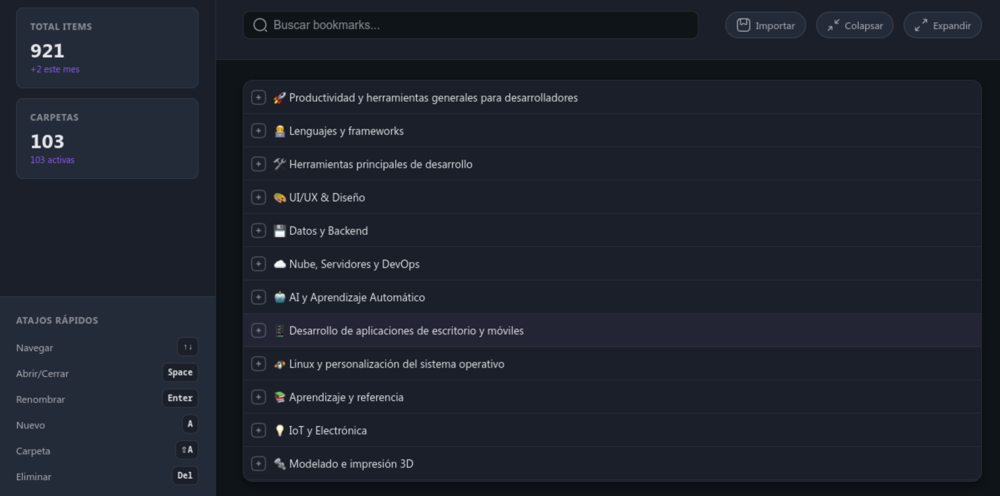

# Plane Bookmark

## Descripción

Plane Bookmark es una aplicación para gestionar marcadores de manera eficiente. Proporciona una interfaz intuitiva para organizar, importar y visualizar marcadores.

## Características

- Importación de marcadores desde archivos JSON.
- Visualización jerárquica de marcadores.
- Edición y eliminación de marcadores.
- Soporte para temas personalizados.

## Requisitos previos

- bun

## Instalación

1. Clona este repositorio:
   ```bash
   git clone https://github.com/tu-usuario/plane-bookmark-react.git
   ```
2. Navega al directorio del proyecto:
   ```bash
   cd plane-bookmark-react
   ```
3. Instala las dependencias:
   ```bash
   bun install
   ```

## Uso

1. Inicia el servidor de desarrollo:
   ```bash
   bun dev
   ```
2. Abre tu navegador y ve a `http://localhost:5173`.

## Uso con Docker Compose

1. Asegúrate de tener Docker y Docker Compose instalados en tu sistema.
2. Construye y levanta los contenedores:
   ```bash
   docker-compose up --build
   ```
3. Accede a la aplicación en tu navegador en `http://localhost:5173`.
4. Para detener los contenedores, ejecuta:
   ```bash
   docker-compose down
   ```

## Estructura del proyecto

```
plane-bookmark-react/
├── public/         # Archivos estáticos
├── src/            # Código fuente
│   ├── components/ # Componentes reutilizables
│   ├── contexts/   # Contextos de React
│   ├── data/       # Datos estáticos
│   ├── hooks/      # Hooks personalizados
│   ├── services/   # Servicios API
│   └── utils/      # Utilidades
├── server/         # Lógica del servidor
└── ...
```

## Scripts disponibles

- `bun run dev`: Inicia el servidor de desarrollo.
- `bun run build`: Genera una versión de producción.
- `bun run preview`: Previsualiza la versión de producción.

## Contribuir

1. Haz un fork del proyecto.
2. Crea una rama para tu funcionalidad (`git checkout -b feature/nueva-funcionalidad`).
3. Realiza tus cambios y haz commit (`git commit -m 'Añade nueva funcionalidad'`).
4. Sube tus cambios (`git push origin feature/nueva-funcionalidad`).
5. Abre un Pull Request.

## Licencia

Este proyecto está bajo la Licencia MIT.

## Captura de Pantalla

A continuación, se muestra una captura de pantalla de la aplicación:



## Importador de Marcadores

La aplicación incluye un importador de marcadores que permite cargar archivos exportados desde Google Chrome. Estos archivos deben estar en formato JSON, que es el formato estándar de exportación de Chrome.

### Cómo usar el importador

1. Exporta tus marcadores desde Google Chrome:
   - Abre Chrome y ve a `chrome://bookmarks/`.
   - Haz clic en el menú de tres puntos (⋮) en la esquina superior derecha.
   - Selecciona `Exportar marcadores` y guarda el archivo JSON.

2. En la aplicación Plane Bookmark React:
   - Navega a la sección de importación de marcadores.
   - Selecciona el archivo JSON exportado desde Chrome.
   - Haz clic en `Importar` para cargar los marcadores en la aplicación.

### Notas

- El importador organiza automáticamente los marcadores en una estructura jerárquica basada en las carpetas definidas en el archivo JSON.
- Asegúrate de que el archivo JSON no esté corrupto para evitar errores durante la importación.

## Archivo de Marcadores del Servidor

El servidor utiliza un archivo JSON para almacenar los marcadores. Este archivo se encuentra en la siguiente ubicación:

```
server/data/bookmarks.json
```

### Notas

- Este archivo contiene la estructura jerárquica de los marcadores almacenados en el servidor.
- Asegúrate de no modificar este archivo manualmente mientras el servidor está en ejecución para evitar inconsistencias.
- Si necesitas inicializar o restaurar los marcadores, puedes reemplazar este archivo con un respaldo válido.
