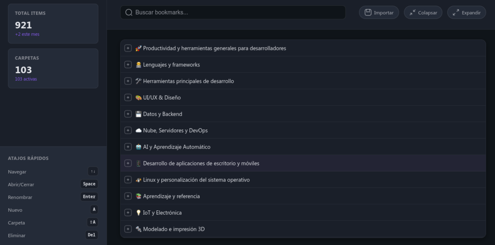

# Plane Bookmark

## Descripción

Plane Bookmark es una aplicación para gestionar marcadores de manera eficiente. Proporciona una interfaz intuitiva para organizar, importar y visualizar marcadores.

## ✨ Nuevas características

- 🚀 **Versionado automático** - Incrementa versión en cada push
- 📊 **Console logs informativos** - Muestra versión, build y entorno
- 🔄 **Sincronización mejorada** - WebSocket para tiempo real
- 🏷️ **Sistema de tags** - Organización avanzada

## 📦 Versionado automático

Este proyecto incluye un sistema de versionado automático que incrementa la versión en cada push a GitHub.

### Console logs al iniciar

```bash
🚀 Plane Bookmark v1.0.0
📦 Build: 2024-01-15T10:30:00.000Z
🌐 Environment: development
🔗 Development mode
```

### Cómo funciona el versionado

1. **Auto-incremento**: Cada push a `main`/`master` incrementa la versión patch automáticamente
2. **Tags**: Se crean tags `v1.0.0`, `v1.0.1`, etc.
3. **Commits**: Se genera commit automático "🔖 Bump version to X.X.X"

### Comandos útiles

```bash
# Ver versión actual
npm run version

# Ver detalles del package
cat package.json | grep '"version"'
```

## Características

- Importación de marcadores desde archivos JSON.
- Visualización jerárquica de marcadores.
- Edición y eliminación de marcadores.
- Soporte para temas personalizados.

## Requisitos previos

- bun

## Instalación

1. Clona este repositorio:
   ```bash
   git clone https://github.com/tu-usuario/plane-bookmark-react.git
   ```
2. Navega al directorio del proyecto:
   ```bash
   cd plane-bookmark-react
   ```
3. Instala las dependencias:
   ```bash
   bun install
   ```

## Uso

1. Inicia el servidor de desarrollo:
   ```bash
   bun dev
   ```
2. Abre tu navegador y ve a `http://localhost:5173`.

## Uso con Docker Compose

### Desarrollo Local

1. Asegúrate de tener Docker y Docker Compose instalados en tu sistema.
2. Construye y levanta los contenedores:
   ```bash
   docker-compose up --build
   ```
3. Accede a la aplicación en tu navegador en `http://localhost:5173`.
4. Para detener los contenedores, ejecuta:
   ```bash
   docker-compose down
   ```

### Producción con Portainer

Si estás usando **Portainer** para desplegar desde un repositorio Git:

1. **En Portainer** → Stacks → Add Stack
2. **Build method:** Repository
3. **Repository URL:** URL de tu repositorio
4. **Compose path:** `docker-compose.prod.yml`
5. **Environment variables:**

   ```
   VITE_API_URL=/api
   NODE_ENV=production
   ```

   ⚠️ **IMPORTANTE:** NO agregues `VITE_SOCKET_URL`. El sistema detecta automáticamente el dominio.

6. Deploy the stack

📖 **Guía completa:** [`docs/portainer-setup.md`](docs/portainer-setup.md)

**Script de verificación:**

```bash
./scripts/check-docker-config.sh
```

## Estructura del proyecto

```
plane-bookmark-react/
├── public/         # Archivos estáticos
├── src/            # Código fuente
│   ├── components/ # Componentes reutilizables
│   ├── contexts/   # Contextos de React
│   ├── data/       # Datos estáticos
│   ├── hooks/      # Hooks personalizados
│   ├── services/   # Servicios API
│   └── utils/      # Utilidades
├── server/         # Lógica del servidor
└── ...
```

## Scripts disponibles

- `bun run dev`: Inicia el servidor de desarrollo.
- `bun run build`: Genera una versión de producción.
- `bun run preview`: Previsualiza la versión de producción.
- `npm run version`: Muestra la versión actual del proyecto.

### 🔍 Script de diagnóstico

Para verificar que todo está configurado correctamente:

```bash
# Diagnóstico básico
./scripts/diagnose.sh

# Diagnóstico con test de dominio
./scripts/diagnose.sh local-book.XXX.com
```

Este script verifica:

- ✅ Node.js instalado
- ✅ Estructura del proyecto
- ✅ Dependencias instaladas
- ✅ Puertos 3001 y 5173
- ✅ Backend respondiendo
- ✅ Archivo de datos
- ✅ Configuración .env
- ✅ Build funcionando

## 🤝 Contribuir

1. Haz un fork del proyecto.
2. Crea una rama para tu funcionalidad (`git checkout -b feature/nueva-funcionalidad`).
3. Realiza tus cambios y haz commit (`git commit -m 'Añade nueva funcionalidad'`).
4. Sube tus cambios (`git push origin feature/nueva-funcionalidad`).
5. Abre un Pull Request.

## 🔧 Configuración con Reverse Proxy

Si estás usando un dominio personalizado (como `local-book.XXX.com`), necesitas configurar un reverse proxy para que el WebSocket funcione correctamente.

### 📚 Guías disponibles:

1. **[Guía Rápida (3 minutos)](docs/nginx-quick-setup.md)** ⚡
   - Configuración paso a paso simplificada
   - Para usuarios con prisa

2. **[Guía Completa con Troubleshooting](docs/nginx-proxy-manager-setup.md)** 📖
   - Explicación detallada de cada paso
   - Soluciones a problemas comunes
   - Configuración avanzada

3. **[Configuración Manual de Nginx/Caddy](docs/nginx-config.md)** 🔧
   - Para usuarios avanzados
   - Configuración sin GUI

### ⚡ Configuración rápida con Nginx Proxy Manager:

```
1. Proxy Host → local-book.XXX.com → localhost:5173
2. Custom Location → /api → localhost:3001
3. Custom Location → /socket.io/ → localhost:3001 (con WebSocket config)
4. SSL → Let's Encrypt (opcional)
5. Save
```

**⚠️ IMPORTANTE:** La location `/socket.io/` debe incluir configuración especial de WebSocket. Ver guías para detalles.

### Variables de entorno

El proyecto detecta automáticamente el entorno:

- **localhost**: Se conecta a `http://localhost:3001`
- **Cualquier otro dominio**: Usa el mismo dominio que la página

Si necesitas configuración personalizada, crea un archivo `.env`:

```bash
cp .env.example .env
# Editar según necesites
```

### 🔍 Verificar que funciona

Abre la consola del navegador (F12) y deberías ver:

```
🔌 Iniciando conexión WebSocket a: https://local-book.XXX.com
✅ WebSocket conectado exitosamente
   Transport: websocket
```

## 🧩 Extensión de Chrome

La extensión permite agregar y editar bookmarks directamente desde cualquier pestaña del navegador, sin necesidad de abrir la aplicación web.

### Funcionalidades

- **Agregar bookmark** — Guarda la pestaña actual con nombre, URL, tags y favicon automáticos
- **Editar bookmark** — Si la URL ya existe en tus bookmarks, permite editarlo
- **Selección de carpeta** — Elige en qué carpeta del árbol guardar el bookmark
- **Obtener favicon** — Descarga automáticamente el icono del sitio
- **Abrir app** — Acceso directo a la aplicación web
- **Configuración** — URL del servidor configurable

### Instalación en modo desarrollo

1. Abre Chrome y ve a `chrome://extensions/`
2. Activa el **Modo de desarrollador** (esquina superior derecha)
3. Haz clic en **Cargar extensión sin empaquetar**
4. Selecciona la carpeta `chrome-extension/` del proyecto
5. La extensión aparecerá en la barra de herramientas de Chrome

### Configuración

Por defecto, la extensión se conecta a `http://localhost:3001`. Si tu servidor está en otra dirección:

1. Haz clic en el icono de la extensión
2. Selecciona **Configuración** (icono de engranaje)
3. Ingresa la URL del servidor (ej: `https://tu-dominio.com`)
4. Guarda los cambios

### Regenerar iconos

Si necesitas regenerar los iconos de la extensión:

```bash
cd chrome-extension
bun generate-icons.js
```

> **Nota:** El servidor backend debe estar corriendo para que la extensión funcione (`bun run dev`).

## Licencia

Este proyecto está bajo la Licencia MIT.

## Captura de Pantalla

A continuación, se muestra una captura de pantalla de la aplicación:



## Importador de Marcadores

La aplicación incluye un importador de marcadores que permite cargar archivos exportados desde Google Chrome. Estos archivos deben estar en formato JSON, que es el formato estándar de exportación de Chrome.

### Cómo usar el importador

1. Exporta tus marcadores desde Google Chrome:
   - Abre Chrome y ve a `chrome://bookmarks/`.
   - Haz clic en el menú de tres puntos (⋮) en la esquina superior derecha.
   - Selecciona `Exportar marcadores` y guarda el archivo JSON.

2. En la aplicación Plane Bookmark React:
   - Navega a la sección de importación de marcadores.
   - Selecciona el archivo JSON exportado desde Chrome.
   - Haz clic en `Importar` para cargar los marcadores en la aplicación.

### Notas

- El importador organiza automáticamente los marcadores en una estructura jerárquica basada en las carpetas definidas en el archivo JSON.
- Asegúrate de que el archivo JSON no esté corrupto para evitar errores durante la importación.

## Archivo de Marcadores del Servidor

El servidor utiliza un archivo JSON para almacenar los marcadores. Este archivo se encuentra en la siguiente ubicación:

```
server/data/bookmarks.json
```

### Notas

- Este archivo contiene la estructura jerárquica de los marcadores almacenados en el servidor.
- Asegúrate de no modificar este archivo manualmente mientras el servidor está en ejecución para evitar inconsistencias.
- Si necesitas inicializar o restaurar los marcadores, puedes reemplazar este archivo con un respaldo válido.
